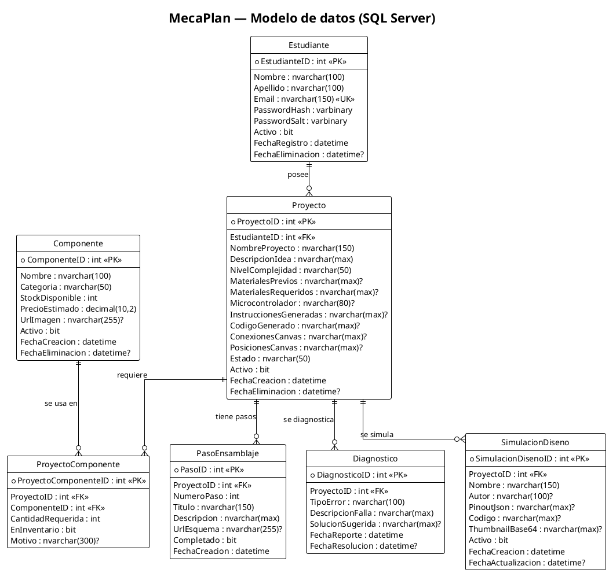
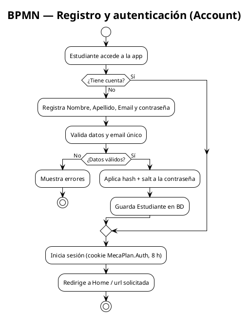
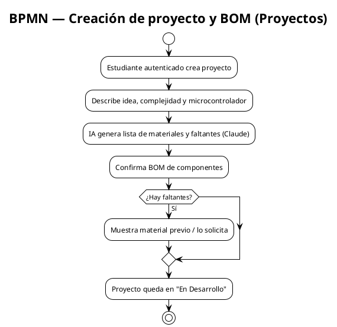
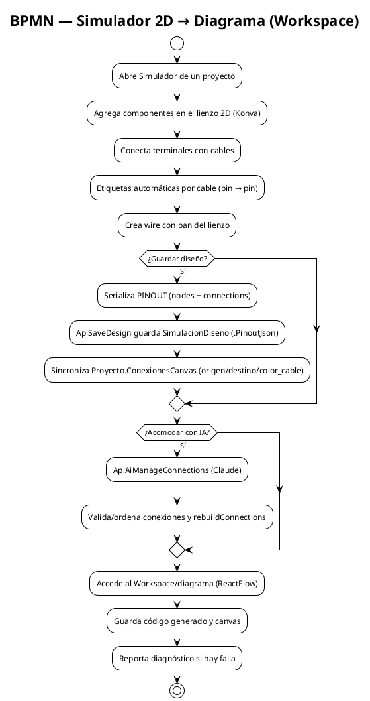
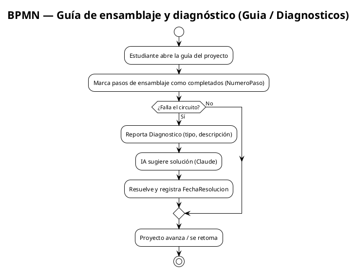

# MecaPlan — Versión Estable V5

Plataforma educativa de diseño, simulación y ensamblaje de proyectos electrónicos (Arduino).
El estudiante registra su proyecto, valida la lista de materiales (BOM), simula el circuito en
un editor 2D, genera el código fuente y sigue una guía de ensamblaje paso a paso.

## Stack tecnológico

| Capa | Tecnología |
|---|---|
| Backend | ASP.NET Core (.NET 10, MVC + API) |
| Base de datos | SQL Server (Entity Framework Core) |
| IA | Anthropic Claude (`claude-sonnet-4-5`) — generación, diagnóstico y gestión de conexiones |
| Simulador 2D | Konva.js + compilador Arduino AVR (avr-gcc-wasm) en el navegador |
| Diagrama / Workspace | ReactFlow (`@xyflow/react`) + React 18 + Vite |
| Frontend adicional | Bootstrap, jQuery (wwwroot/lib) |

## Diagrama de base de datos (ERD)

Modelo relacional de `MecaPlanDB`. Las relaciones clave:

- **Estudiante** 1 — N **Proyectos**
- **Proyecto** 1 — N **ProyectoComponentes** (N — 1 **Componente**)
- **Proyecto** 1 — N **PasosEnsamblaje**
- **Proyecto** 1 — N **Diagnosticos**
- **Proyecto** 1 — N **SimulacionDisenos**

Consulta el script SQL completo en `docs/SCRIPT_BD.sql`.

Los archivos fuente PlantUML de todos los diagramas viven en `docs/diagrams/*.puml`
(si quieres regenerar las imágenes, ábrelos en [PlantUML](https://plantuml.com/) o VS Code
con la extensión PlantUML).

## Diagramas BPM (procesos de negocio)

### BPMN 1 — Registro y autenticación de estudiante

### BPMN 2 — Creación de proyecto y validación de BOM

### BPMN 3 — Flujo del simulador 2D y sincronización con el diagrama

### BPMN 4 — Guía de ensamblaje y diagnóstico

## Módulos principales

| Ruta | Módulo | Descripción |
|---|---|---|
| `/Account/*` | Autenticación | Registro, login, logout (cookie) |
| `/Proyectos` | Proyectos | Detalle, BOM, Workspace, Guía, Diagnóstico |
| `/Simulador` | Simulador 2D | Editor de circuito con IA (Claude) |
| `/Biblioteca` | Biblioteca | Manuales, datasheets, normativas, guías |
| `/Esquemas`, `/Galeria` | Esquemas / Galería | Visualización de diseños |
| `/Diagnosticos` | Diagnósticos | Historial y resolución de fallas |

## Requisitos para ejecutar

- .NET 10 SDK + SQL Server (o contenedor `mecaplan-sql` en el puerto 1433).
- Clave de Anthropic en `appsettings.Development.json` (no versionada) o UserSecrets.
- Clave de Google Gemini en `Simulador/.env` (no versionada) si usas la API Node.